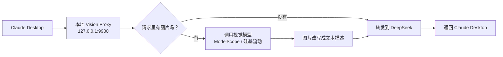
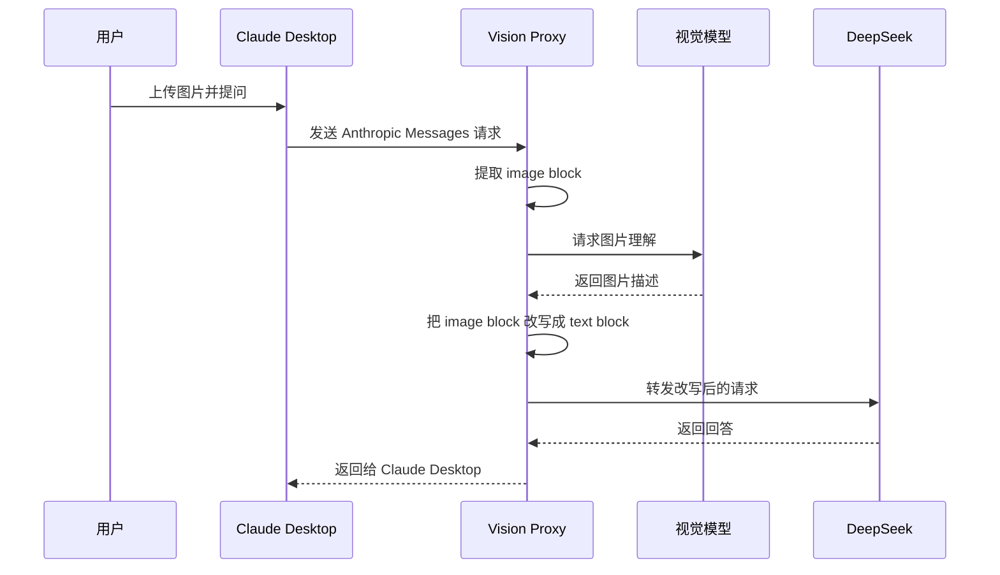
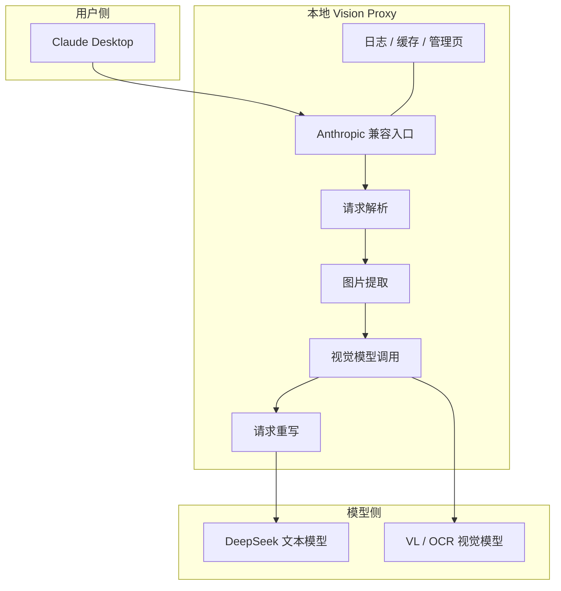
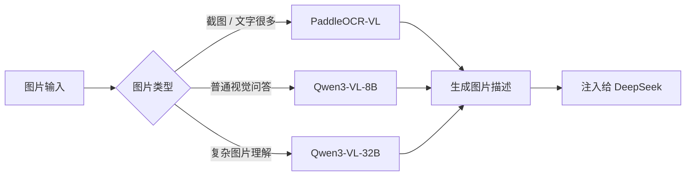
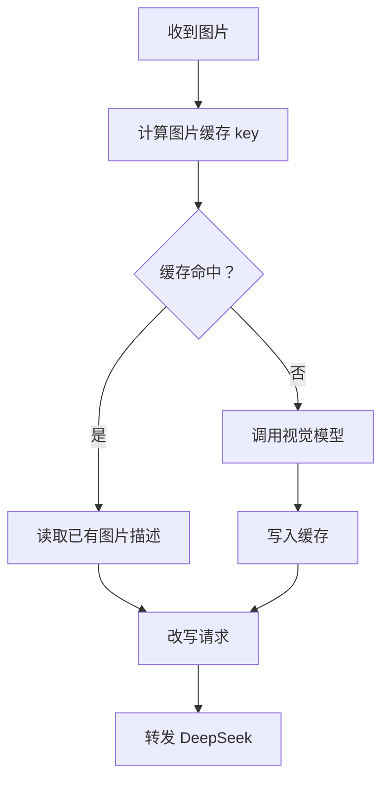
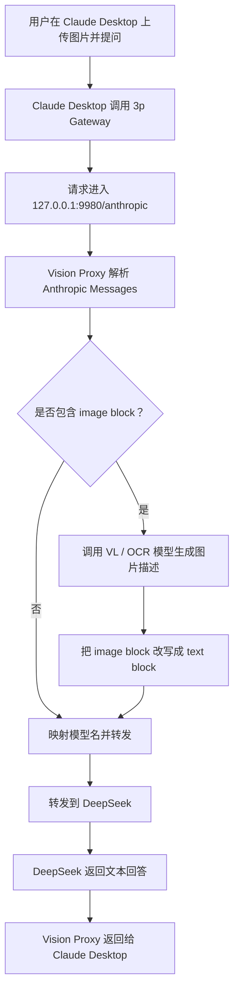

# 给 DeepSeek 装上一双“眼睛”：一个 Claude Desktop 视觉代理的设计笔记

项目地址：

[https://github.com/STEPHENXING/vision_proxy_4_claude_desktop](https://github.com/STEPHENXING/vision_proxy_4_claude_desktop)

有些工具不是为了变得很庞大，而是为了把一个具体的卡点补上。

这次做的这个项目叫 **vision_proxy_4_claude_desktop**。它的目标很明确：

> 在 Claude Desktop 里使用 DeepSeek 这类文本模型时，如果用户上传了图片，就先让视觉模型把图片读出来，再把图片内容变成文本交给 DeepSeek。

也就是说，我们没有试图改造 DeepSeek 本身，而是在 Claude Desktop 和 DeepSeek 之间加了一层本地代理。

这层代理负责把“图片问题”翻译成“文本问题”。

## 一句话架构

用户还是在 Claude Desktop 里正常聊天、正常上传图片。

Claude Desktop 的请求先进入本地代理，代理检查请求里有没有图片。如果没有图片，就直接转发给 DeepSeek。如果有图片，就调用视觉模型生成描述，再把描述补进原请求，最后转发给 DeepSeek。



这个模式最大的好处是：Claude Desktop 不需要知道背后发生了什么，DeepSeek 也不需要原生支持图片输入。代理把中间这件麻烦事接住了。

## 它到底解决了什么问题？

很多人用 Claude Desktop 的 3p Gateway 能力接第三方模型，比如 DeepSeek。

文本聊天通常没有问题，但一旦用户上传图片，麻烦就来了：DeepSeek 的文本模型并不能直接理解图片。于是你会看到类似这样的回答：

> 我看到了你上传了一张图片，但我无法读取图片内容。

这不是用户操作错了，而是模型链路里缺了一段视觉理解。

这个项目做的事情就是补上这一段。



从用户体验上看，还是原来的 Claude Desktop。

从模型链路上看，DeepSeek 收到的是一段已经包含图片描述的文本上下文。

## 设计亮点 1：本地网关，不入侵客户端

我比较喜欢这个项目的一个点是：它没有去改 Claude Desktop 的程序文件，也没有尝试做一个复杂插件，而是采用了本地网关的方式。

Claude Desktop 的 3p Gateway 指向：

```text
http://127.0.0.1:9980/anthropic
```

代理收到请求后，再转发到：

```text
https://api.deepseek.com/anthropic
```

整体结构是这样的：



这样设计的好处很朴素：

- Claude Desktop 还是 Claude Desktop。
- DeepSeek 还是 DeepSeek。
- 视觉能力通过代理层补上。
- 出问题时可以在代理层看日志、看改写后的请求、看模型调用结果。

也就是说，它不是一个大而全的新客户端，而是一个专注的“中间层”。

## 设计亮点 2：视觉模型可以切换

项目目前支持两类视觉服务：

- ModelScope
- 硅基流动 SiliconFlow

硅基流动这边支持几个模型别名：

```text
paddleocr    -> PaddlePaddle/PaddleOCR-VL-1.5
qwen3-vl-8b  -> Qwen/Qwen3-VL-8B-Instruct
qwen3-vl-32b -> Qwen/Qwen3-VL-32B-Instruct
```

视觉服务自己的 key 由本地代理进程从环境变量读取，比如 `GUIJILIUDONG_API_KEY` 或 `MODELSCOPE_API_KEY`。

这件事很有用。

因为“看图”并不是一个单一任务。截图、表格、UI 界面、普通照片、复杂图表，对模型的要求是不一样的。



比如：

- 如果图片主要是文字、截图、代码界面，可以偏向 OCR 能力强的模型。
- 如果只是普通图片问答，可以用更轻的 8B 模型。
- 如果图片内容复杂，再切到更强的 32B 模型。

模型不是写死的，这让整个代理更像一个可调的工具，而不是一次性的脚本。

## 设计亮点 3：管理页面把复杂操作收起来

项目里带了一个本地管理页面：

```text
http://127.0.0.1:9980/admin
```

它可以做这些事情：

- 切换视觉 provider：ModelScope / 硅基流动。
- 切换视觉模型：PaddleOCR、Qwen3-VL-8B、Qwen3-VL-32B 等。
- 查看视觉 API Key 是否已经被当前进程读取。
- 打开或关闭图片改写。
- 修改视觉模型超时和图片大小上限。
- 清理图片描述缓存。
- 查看最近一次请求摘要。
- 查看最近一次改写后的请求体。
- 查看 proxy log。
- 一键应用 Claude Desktop 3p Gateway 配置。
- 从备份恢复 Claude Desktop 3p 配置。

这其实很重要。

一开始做这类工具，最容易变成“你去手动改这个 JSON，再去复制那个 URL，再去重启客户端”。能跑，但不好用，也不安心。

所以管理页的目标不是做得花哨，而是把日常高频操作收进去，让用户知道现在链路到底指向哪里。

## Claude Desktop 配置到底改了什么？

这是我觉得最应该讲清楚的地方。

因为一个工具只要说“我会帮你修改 Claude Desktop 配置”，很多人第一反应都会有点紧张：它到底改了哪里？会不会动到主程序？能不能恢复？

这个项目只操作 Claude Desktop 3p 的配置库目录：

```text
C:\Users\<你的用户名>\AppData\Local\Claude-3p\configLibrary
```

在当前项目默认配置里，主要涉及两个 JSON 文件：

```text
C:\Users\<你的用户名>\AppData\Local\Claude-3p\configLibrary\_meta.json

C:\Users\<你的用户名>\AppData\Local\Claude-3p\configLibrary\00000000-0000-4000-8000-000000157210.json
```

注意，第二个文件名里的 `157210` 是 provider id 的一部分，不是端口号。真正的代理端口是 `9980`。

### 1. `_meta.json`：负责“当前启用哪个 provider”

`_meta.json` 可以理解成 Claude Desktop 3p provider 的索引和当前选择。

代理写入的核心信息类似这样：

```json
{
  "appliedId": "00000000-0000-4000-8000-000000157210",
  "entries": [
    {
      "id": "00000000-0000-4000-8000-000000157210",
      "name": "Vision Proxy"
    }
  ]
}
```

它表达的是：

- 当前启用的 provider id 是哪个。
- 这个 provider 在界面里显示为什么名字。

所以 `_meta.json` 更像“开关”和“目录”。

它不负责网关 URL，也不负责 API Key。

### 2. provider JSON：负责“这个 provider 怎么请求”

真正的网关配置在 provider JSON 里。

默认文件是：

```text
00000000-0000-4000-8000-000000157210.json
```

这个文件负责告诉 Claude Desktop：

- 这是一个 gateway provider。
- 请求应该发到哪个 base URL。
- 鉴权方式是什么。
- 使用哪个 API Key。
- Claude Desktop 的模型下拉里显示哪些模型。

代理会写入或更新类似这些字段：

```json
{
  "inferenceProvider": "gateway",
  "inferenceGatewayBaseUrl": "http://127.0.0.1:9980/anthropic",
  "inferenceGatewayAuthScheme": "bearer",
  "inferenceGatewayApiKey": "你的 DeepSeek API Key",
  "inferenceModels": [
    {"name": "claude-sonnet-4-6"},
    {"name": "claude-opus-4-8"},
    {"name": "claude-haiku-4-5"}
  ],
  "coworkEgressAllowedHosts": ["*"],
  "disableDeploymentModeChooser": true
}
```

其中最关键的是：

```text
inferenceGatewayBaseUrl = http://127.0.0.1:9980/anthropic
```

Claude Desktop 后续会把 Anthropic API 路径拼到这个 base URL 后面，例如：

```text
http://127.0.0.1:9980/anthropic/v1/messages
```

代理再把它转发到 DeepSeek：

```text
https://api.deepseek.com/anthropic/v1/messages
```

这里还有一个容易让人误会的字段：

```text
inferenceModels
```

它影响的是 Claude Desktop 里的模型下拉列表。我们希望这里显示的是 Claude-facing 的模型名，比如 `claude-sonnet-4-6`、`claude-opus-4-8`、`claude-haiku-4-5`。

真正转发给 DeepSeek 时，代理会在内部再把这些模型名映射成 DeepSeek 的模型名。这样用户界面保持自然，底层转发也能正常工作。

### 3. API Key 写在哪里？

Claude Desktop 3p Gateway 的 API Key 会写入 provider JSON：

```text
inferenceGatewayApiKey
```

这通常是 DeepSeek 侧需要的 key，因为 Claude Desktop 要靠它调用这个 gateway。

### 4. 修改前会备份，恢复时也会保护现场

代理的备份目录是：

```text
C:\Users\<你的用户名>\AppData\Local\Claude-3p\configLibrary\vision-proxy-backups
```

点击管理页里的 `Apply 3p Gateway` 时，如果检测到配置确实会发生变化，代理会先备份当前的：

```text
_meta.json
00000000-0000-4000-8000-000000157210.json
```

然后再写入新配置。

如果当前配置已经是：

```text
http://127.0.0.1:9980/anthropic
```

并且 API Key 也没有变化，重复点击 Apply 不会制造新的备份。

点击 `Restore Selected Backup` 时，代理会从备份目录中选择一个历史版本恢复。恢复前也会先给当前状态做一次备份，避免“恢复错了就回不去”。

这套逻辑的目标很简单：能自动化，但不要让用户失去退路。

### 5. 应用或恢复后要重启 Claude Desktop

修改 JSON 文件之后，Claude Desktop 不一定会立刻重新读取配置。

所以无论是 Apply 还是 Restore，建议都重启一次 Claude Desktop。

这个步骤看起来笨，但很可靠。

## 设计亮点 4：缓存和日志让调试不再靠猜

图片理解是有成本的。

同一张图片如果反复问，不应该每次都重新调用视觉模型。所以项目里加了图片描述缓存。



同时，代理会保存：

- 最近一次原始请求。
- 最近一次请求摘要。
- 最近一次改写后转发给 DeepSeek 的请求。
- proxy 运行日志。

这对排查问题非常有帮助。

比如模型回答“我看不到图片”，我们就可以顺着链路检查：

- Claude Desktop 有没有真的发出 image block。
- 代理有没有识别到图片。
- 视觉 API Key 有没有读取成功。
- 视觉模型有没有返回描述。
- 改写后的请求里 image block 是否已经变成 text block。
- DeepSeek 是否正常返回。

有日志以后，问题就不再是黑盒。

## 为什么现在不太需要 CC Switch 了？

以前我们可以用 CC Switch 来管理 Claude Desktop 的 3p provider。

现在这个项目自己已经能做这些事：

- 写入 Claude Desktop 3p provider 配置。
- 设置 gateway URL。
- 保存 provider API Key。
- 修改 `_meta.json` 让 Claude Desktop 启用 Vision Proxy。
- 自动备份。
- 从备份恢复。

所以在这个项目的使用场景里，日常已经不需要 CC Switch 作为中间层。

推荐链路变成：

```text
Claude Desktop
-> Vision Proxy: http://127.0.0.1:9980/anthropic
-> DeepSeek Anthropic-compatible API
```

少一层中转，调试也更清楚。

当然，如果你已经有一套 CC Switch 工作流，也可以保留它作为备用配置工具。但对于这个代理本身来说，它已经具备了管理 Claude Desktop 3p 配置的能力。

## 一个完整请求会怎么走？



从外面看，用户只是问了一句“这张图里有什么？”。

从里面看，请求经历了图片抽取、视觉理解、文本注入、模型映射、上游转发这几步。

## 安全边界

这个项目的安全边界可以概括为几句话：

- 它运行在本机 `127.0.0.1:9980`。
- 它不修改 Claude Desktop 主程序目录。
- 它只操作 Claude Desktop 3p provider 配置目录中的指定 JSON。
- 修改前会备份。
- 视觉服务 key 通过环境变量读取。
- 请求日志和缓存落在本机用户目录下。

本地调试文件主要在：

```text
C:\Users\<你的用户名>\.claude\vision_proxy_http
```

这里会包含请求摘要、改写后的请求、日志和图片描述缓存。它们对排错很有用，但如果要公开分享日志，记得先检查里面有没有敏感信息。

## 它适合谁？

如果你正在用 Claude Desktop 的 3p Gateway 接 DeepSeek，并且希望它能处理图片、截图、界面文字、报错截图，那么这个工具就很适合。

它不是一个大平台，也不是另一个聊天客户端。

它更像是一块插在模型链路里的小电路板：

```text
原本：
Claude Desktop -> DeepSeek

现在：
Claude Desktop -> Vision Proxy -> DeepSeek
                         |
                         -> VL / OCR 模型
```

它的目标只有一个：

> 让不懂图片的文本模型，在 Claude Desktop 里获得可用的视觉入口。

项目地址：

[https://github.com/STEPHENXING/vision_proxy_4_claude_desktop](https://github.com/STEPHENXING/vision_proxy_4_claude_desktop)

后面还可以继续增强，比如：

- 按图片类型自动选择 OCR 或通用 VL 模型。
- 给不同模型设置成本和延迟策略。
- 支持更多视觉服务商。
- 给管理页增加更完整的诊断面板。
- 对截图、代码、表格做更细的提示词优化。

但就现在这个版本来说，它已经完成了一件很实用的事：

**给 DeepSeek 接上眼睛，而且尽量不打扰原来的聊天体验。**
